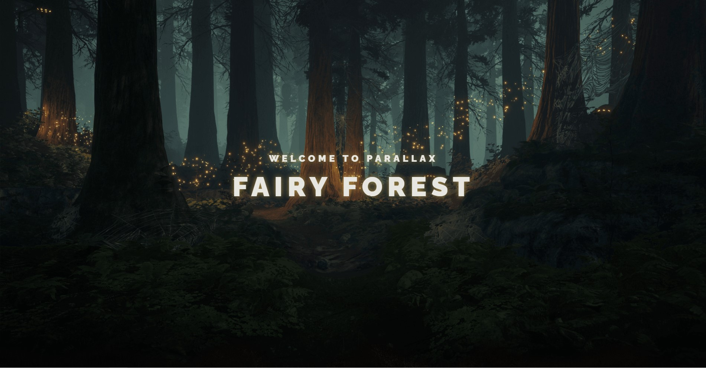

# **ParallaxGsap**

### An example of using the **GSAP** library to create scrolling effects with a minimum amount of code for maximum effect.

[ParallaxGsap - demo](https://krokholevviktor.github.io/ParallaxGsap/) 

